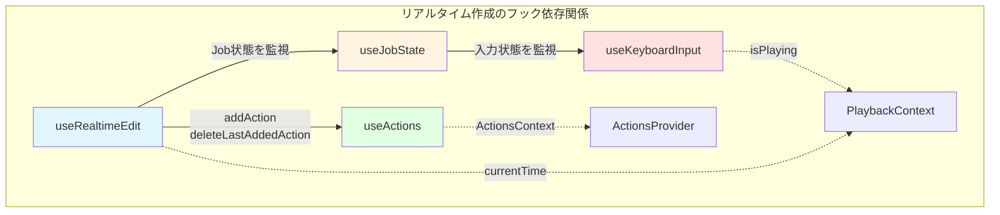
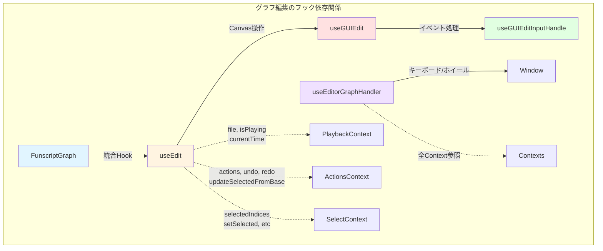
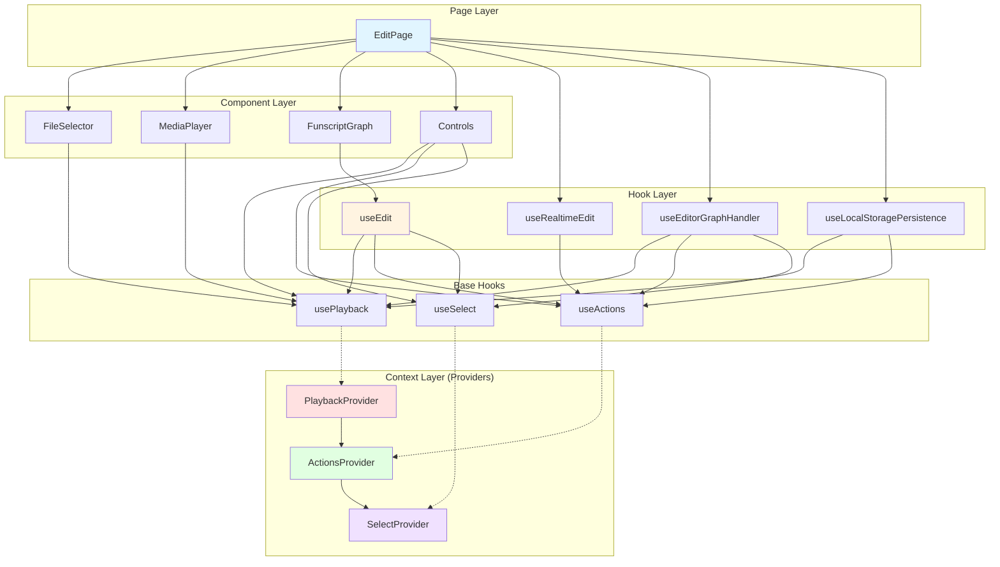
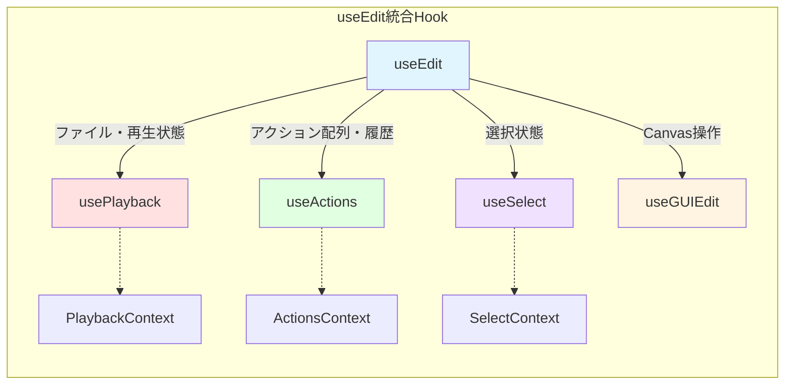
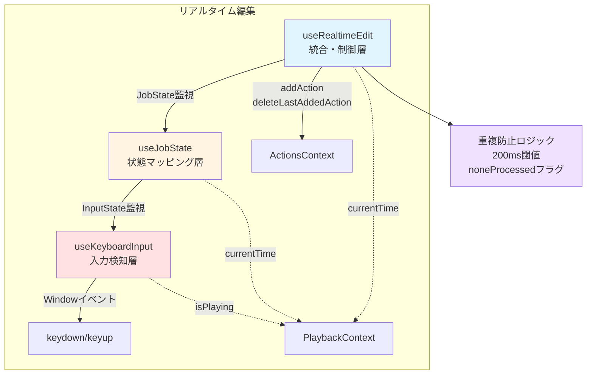
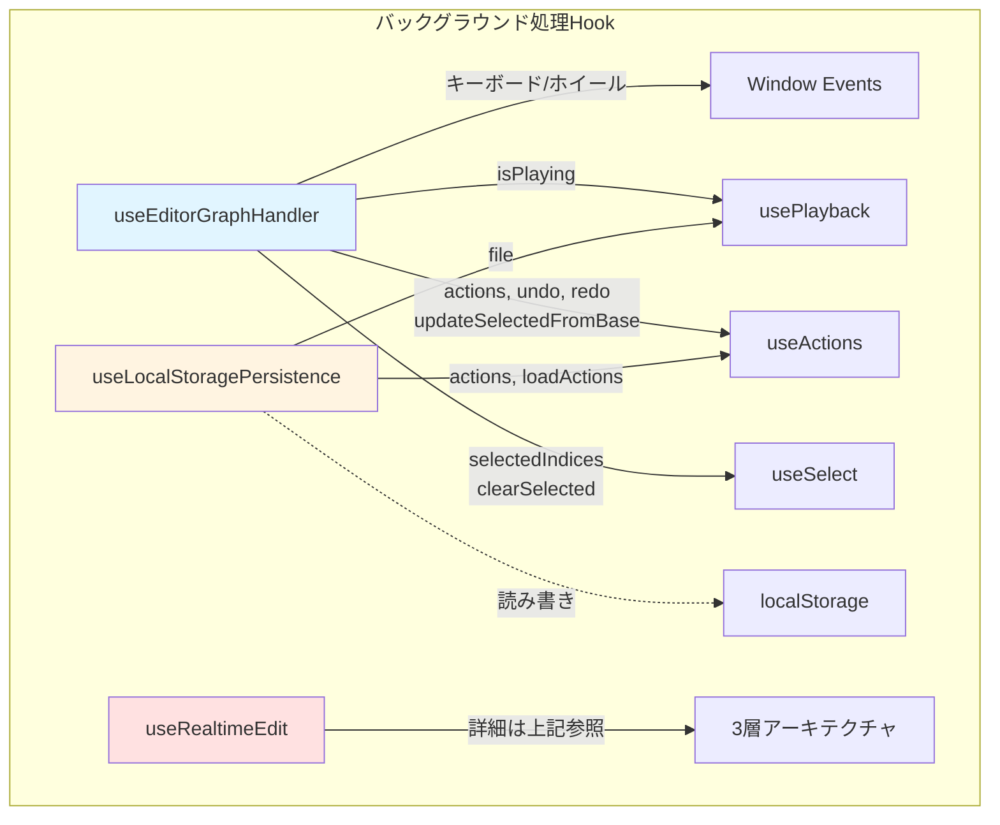
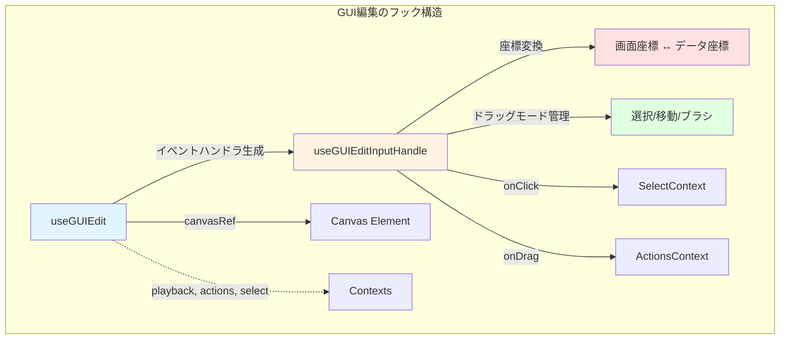

# DesignDoc: Funscript Editor

## Abstract/Summary

音声や動画を視聴しながら funscript ファイルをリアルタイムで作成できる編集画面。作成したデータはグラフ上で視覚的に編集可能。キーボード入力による直感的な作成と、マウス操作による精密な編集の両方をサポートする。

## Goals

- メディア再生中のリアルタイムな funscript 作成
- 視覚的なグラフ編集による精密な調整
- 自動補正による快適な入力体験
- localStorage による編集データの永続化
- 標準形式でのエクスポート機能

## Proposed Design

### 1. メディア再生中の編集（リアルタイム作成モード）

メディア再生中は、キーボード入力でFunscriptActionをリアルタイムに作成する。視聴しながら直感的に動きを記録できる。

#### 1.1 入力方法

**J/Kキーによるリアルタイム作成:**

- **Jキー（下降）**: 押下時に`pos: 100`を記録、解放時に`pos: 0`を記録
- **Kキー（上昇）**: 押下時に`pos: 0`を記録、解放時に`pos: 100`を記録



##### **実装アーキテクチャ: 3層のHookシステム**

```text
useKeyboardInput → useJobState → useRealtimeEdit
     ↓                ↓              ↓
  入力状態          Job状態      Funscript作成
```

**1. useKeyboardInput**: キーボードの物理的な入力状態を管理

- 状態: `none` | `j-pressed` | `k-pressed` | `j-and-k-j-first` | `j-and-k-k-first`
- `e.repeat` を無視して純粋な押下/解放イベントのみを処理
- useState で状態管理（React の再レンダリングを適切にトリガー）

**2. useJobState**: 入力状態を Job（作業）状態にマッピング

- 状態: `none` | `100-0` | `0-100` | `0-0` | `100-100`
- 各状態は開始タイムスタンプ（startedAt）を保持
- 前回の状態（prev）も追跡して状態遷移を判定

**3. useRealtimeEdit**: Job状態の遷移に基づいて FunscriptAction を記録

- 状態遷移時に適切な pos 値（0 or 100）を記録
- 200ms 以内の重複アクション防止機能
- 同時押しからの片方解放時の特殊処理（deleteLastAction）

##### **J キー（下降）**

- **J down**: `{at: currentTime, pos: 100}` を記録（下降開始）
- **J up**: `{at: currentTime, pos: 0}` を記録（下降終了）
- Job状態: `100-0`（100から0に向かっている）

##### **K キー（上昇）**

- **K down**: `{at: currentTime, pos: 0}` を記録（上昇開始）
- **K up**: `{at: currentTime, pos: 100}` を記録（上昇終了）
- Job状態: `0-100`（0から100に向かっている）

#### 1.2 自動補正機能

##### **補正ルール1: 重複アクション防止（200ms閾値）**

同じ pos 値のアクションが 200ms 以内に連続して記録されそうになった場合、2つ目をスキップする。

**実装詳細:**

- `useRealtimeEdit` 内で `prevAddedAction` を状態管理
- `addAction` 実行前に `prevAddedAction.pos === action.pos && action.at - prevAddedAction.at < 200` をチェック
- 条件に該当する場合は早期リターンでスキップ

**効果:**

- currentTime の高頻度更新（~60fps via requestAnimationFrame）による重複記録を防止
- 状態遷移が複数回トリガーされても同じタイムスタンプ付近では1回だけ記録

##### **補正ルール2: 同時押しからの片方解放処理**

両方のキーが押されている状態から片方だけを離した場合の特殊処理。

###### ケース1: J, K 同時押し → J を離す

- Job状態遷移: `0-0` → `0-100`
- 通常なら `pos: 0` を記録するが、直前の `pos: 0` と重複
- 処理: **直前のアクションを削除**（`deleteLastAction()`）

###### ケース2: J, K 同時押し → K を離す

- Job状態遷移: `100-100` → `100-0`
- 通常なら `pos: 100` を記録するが、直前の `pos: 100` と重複
- 処理: **直前のアクションを削除**（`deleteLastAction()`）

**実装:**

```typescript
switch (jobState.type) {
  case '100-0':
    if (jobState.prev === '0-0') {
      deleteLastAction()
      return
    }
    // ...
  case '0-100':
    if (jobState.prev === '100-100') {
      deleteLastAction()
      return
    }
    // ...
}
```

##### **補正ルール3: none状態での重複実行防止**

キーを離した後の `none` 状態で、currentTime の更新による useEffect 再実行で重複記録されるのを防ぐ。

**実装:**

- `noneProcessed` フラグを useState で管理
- `none` 状態でアクション記録後に `setNoneProcessed(true)`
- 次に他の状態（`100-0`, `0-100`, `0-0`, `100-100`）へ遷移した時に `setNoneProcessed(false)` でリセット

**動作:**

1. キー離す → `none` 状態 → アクション記録 → `noneProcessed = true`
2. currentTime 更新 → `none` のまま → `noneProcessed === true` のためスキップ
3. 次のキー押下 → 他の状態へ遷移 → `noneProcessed = false` でリセット

### 2. メディア停止中の編集（グラフ編集モード）

メディア停止中は、グラフ上で作成済みのFunscriptActionを視覚的に編集する。マウスとキーボードで精密な調整が可能。

#### 2.1 グラフ表示

線グラフで FunscriptAction の連続データを可視化。

- **Y軸**: `pos` 値（100 = グラフの底部、0 = グラフの天井部）
- **X軸**: `at` 値（時間・ミリ秒）
- 各 FunscriptAction を点として表示し、線で結ぶ



#### 2.2 選択操作

- **クリック**: 単一選択（1つの点を選択）
- **Shift + クリック**: 範囲選択（最後に選択した点から、クリックした点までの範囲）
- **Alt/Option + クリック**: 追加選択（既存の選択を維持したまま点を追加）

#### 2.3 編集操作

##### **上下移動**

- **ホイールスクロール** / **J/Kキー**: 選択中の点のpos値を上下に移動
- 移動量: 通常5単位、Alt/Option押下時は1単位
- pos値は0-100の範囲にクランプ

##### **拡大/縮小**

- **Alt/Option + ホイールスクロール**: pos: 50を基準に選択点を拡大/縮小
- 拡大縮小率: 1.1倍 または 0.9倍
- 50より上の点はより上へ、下の点はより下へ（拡大時）

##### **削除**

- **Delete / Backspace**: 選択中の点をすべて削除
- 削除後、選択状態は自動的にクリア

##### **Undo/Redo**

- **Ctrl+Z / Cmd+Z**: 元に戻す
- **Ctrl+Y / Cmd+Shift+Z**: やり直し
- 履歴スタックで全ての編集操作を管理

### 3. データ構造

#### 3.1 FunscriptAction

```typescript
// src/lib/funscript の FunscriptAction を使用
interface FunscriptAction {
  at: number;  // タイムスタンプ（ミリ秒）
  pos: number; // ポジション（0-100）
}

// 配列として時系列順に保持
FunscriptAction[]
```

### 4. データ永続化（localStorage）

#### 4.1 保存キーの生成

音声/動画ファイルごとに一意のキーでlocalStorageに保存。

```typescript
// /lib/utils/fileId の generateFileId 関数を使用
const storageKey = `edit-${generateFileId(file)}`;
```

#### 4.2 自動保存・読み込み

**useLocalStoragePersistence Hook が処理:**

- **ファイル読み込み時**: localStorageから該当ファイルのデータを自動読み込み
- **アクション変更時**: 自動的にlocalStorageへ保存
- **保存データ構造**:

  ```typescript
  {
    actions: FunscriptAction[],
    lastModified: number,
  }
  ```

**実装:**

- usePlaybackからfileを取得
- useActionsからactions, loadActionsを取得
- useEffect でファイル変更を監視 → localStorage読み込み
- useEffect でアクション変更を監視 → localStorage保存

### 5. エクスポート機能

#### 5.1 ファイル名

対応する音声/動画ファイルと同じ名前で `.funscript` 拡張子を付与。

```text
// 例
video.mp4 → video.funscript
audio.mp3 → audio.funscript
```

#### 5.2 エクスポート形式

`src/lib/funscript` の `Funscript` interface に準拠した JSON ファイル。

```typescript
interface Funscript {
  version?: string;
  inverted?: boolean;
  range?: number;
  metadata?: FunscriptMeta;
  actions: FunscriptAction[];
}
```

##### **エクスポート時の処理フロー**

1. localStorage から編集データを取得
2. `Funscript` 形式に整形（必要に応じて metadata を追加）
3. `sanitizeFunscript()` で検証・正規化（ソート、クランプ）
4. `JSON.stringify()` でシリアライズ
5. Blob 作成してダウンロード

### 6. UI レイアウト

#### 6.1 画面構成

```text
┌─────────────────────────────────────┐
│ メディアプレイヤー（動画/音声）       │
│ - 再生/一時停止                      │
│ - シークバー                         │
├─────────────────────────────────────┤
│ グラフエリア（編集）                 │
│ - FunscriptAction の線グラフ         │
│ - Y軸: pos (0-100)                  │
│ - X軸: at (時間)                     │
│ - 選択ハイライト                     │
│ - 現在再生位置の表示                 │
├─────────────────────────────────────┤
│ コントロールパネル                   │
│ [エクスポート] [クリア] [設定]       │
│ 選択中: N点 | 合計: M点              │
└─────────────────────────────────────┘
```

#### 6.2 操作ガイド

##### **再生中（作成モード）**

- `J`: 下降 (100→0)
- `K`: 上昇 (0→100)

##### **停止中（編集モード）**

- `クリック`: 単一選択
- `Shift+クリック`: 範囲選択
- `Alt/Option+クリック`: 追加選択
- `スクロール` / `J/K`: 上下移動
- `Alt/Option+スクロール`: 拡大/縮小
- `Delete` / `Backspace`: 削除
- `Ctrl+Z` / `Cmd+Z`: Undo
- `Ctrl+Y` / `Cmd+Shift+Z`: Redo

### 7. 技術実装詳細

#### 7.1 使用技術

- **グラフ描画**: Canvas API（パフォーマンス重視）
- **メディアプレイヤー**: HTML5 `<video>`/`<audio>` element
- **キーボードイベント**: Window level `keydown`/`keyup` listeners
- **ファイル操作**: File API, Blob
- **高頻度タイムスタンプ更新**: `requestAnimationFrame` で ~60fps
- **状態管理**: React Context API + useReducer（モジュラー構造）
- **型安全性**: TypeScript strict mode

#### 7.2 状態管理アーキテクチャ

モジュラーなReact Context + useReducerパターンで、関心の分離を実現。各機能領域ごとに独立したContextを持つ。

##### **全体アーキテクチャ図**



##### **Context構造（3層のProvider）:**

```typescript
// layout.tsx でのネスト構造
<PlaybackProvider>      // メディア再生とファイル管理
  <ActionsProvider>     // Funscriptアクション配列と履歴
    <SelectProvider>    // 選択状態管理
      {children}
    </SelectProvider>
  </ActionsProvider>
</PlaybackProvider>
```

##### **1. PlaybackContext (最外層)**

```typescript
{
  file: File | null,           // 読み込まれたメディアファイル
  isPlaying: boolean,          // 再生状態
  currentTime: number,         // 現在時刻（ミリ秒、~60fps更新）
  loadFile: (file: File) => void,
  setPlaying: (isPlaying: boolean) => void,
  setCurrentTime: (time: number) => void,
}
```

##### **2. ActionsContext (中間層)**

```typescript
{
  actions: FunscriptAction[],  // アクション配列
  history: {
    past: FunscriptAction[][],
    future: FunscriptAction[][],
  },
  loadActions: (actions: FunscriptAction[]) => void,
  addAction: (action: FunscriptAction) => void,
  updateAction: (index: number, action: FunscriptAction) => void,
  deleteActions: (indices: number[]) => void,
  deleteLastAddedAction: () => void,
  clearActions: () => void,
  undo: () => void,
  redo: () => void,
  updateSelectedFromBase: (
    indices: number[],
    baseActions: FunscriptAction[],
    updateFn: (action: FunscriptAction, index: number) => FunscriptAction
  ) => void,
}
```

##### **3. SelectContext (最内層)**

```typescript
{
  selectedIndices: number[],   // 選択中のインデックス配列
  lastSelectedIndex: number | null,
  setSelected: (indices: number[]) => void,
  addSelected: (index: number) => void,
  setRangeSelected: (startIndex: number, endIndex: number) => void,
  clearSelected: () => void,
}
```

##### **統合Hook: useEdit**

複数のContextを統合し、コンポーネントから簡単にアクセスできるようにする。



```typescript
// _hooks/edit/useEdit.ts
export const useEdit = (canvasRef?: React.RefObject<HTMLCanvasElement>) => {
  const playback = usePlayback()
  const actions = useActions(playback.file, savePersistent)
  const select = useSelect()
  const guiEdit = useGUIEdit(canvasRef, { playback, actions, select })

  return {
    // Playback
    file: playback.file,
    isPlaying: playback.isPlaying,
    currentTime: playback.currentTime,
    loadFile: playback.loadFile,
    setPlaying: playback.setPlaying,
    setCurrentTime: playback.setCurrentTime,

    // Actions
    actions: actions.actions,
    history: actions.history,
    addAction: actions.addAction,
    // ... 他のactionsメソッド

    // Select
    selectedIndices: select.selectedIndices,
    // ... 他のselectメソッド

    // GUI Edit handlers (canvasRefが提供された場合)
    onClick: guiEdit?.onClick,
    onMouseDown: guiEdit?.onMouseDown,
    onMouseMove: guiEdit?.onMouseMove,
    onMouseUp: guiEdit?.onMouseUp,
  }
}
```

##### **リアルタイム編集のHook構成:**



```typescript
// 3層アーキテクチャ（変更なし）
useKeyboardInput({ isPlaying })
  ↓ InputStateType を返す
useJobState({ isPlaying, currentTime })
  ↓ JobState (type + prev + startedAt) を返す
useRealtimeEdit({ isPlaying, currentTime })
  ↓ useActions の addAction / deleteLastAddedAction を呼ぶ
```

**各Hookの責務:**

1. **useKeyboardInput**
   - キーボードイベントのリスニングと状態管理
   - `e.repeat` の除外
   - useState で InputStateType を管理（React 再レンダリング対応）

2. **useJobState**
   - InputStateType を JobStateType にマッピング
   - 前回の状態（prev）と現在の状態（type）を追跡
   - 状態開始時のタイムスタンプ（startedAt）を記録

3. **useRealtimeEdit**
   - Job状態の遷移に基づいて FunscriptAction を作成
   - 重複防止ロジック（200ms閾値、noneProcessed フラグ）
   - 同時押しからの片方解放時の特殊処理（deleteLastAddedAction）

##### **バックグラウンド処理Hook:**

コンポーネントUIを持たない処理は、専用のHookとして実装し、page.tsxから呼び出す。



##### **1. useEditorGraphHandler**

- キーボードとホイールイベントのグローバルリスナー
- 選択中の点の移動・拡大縮小処理
- Undo/Redo (Ctrl+Z / Ctrl+Y)
- Delete/Backspace による削除（削除後に選択状態をクリア）

##### **2. useLocalStoragePersistence**

- ファイル変更時にlocalStorageから自動読み込み
- アクション変更時に自動保存
- ファイルごとに一意のキーで管理

##### **3. useRealtimeEdit**

- 再生中のキーボード入力でリアルタイムにアクション作成

##### **GUI編集Hook:**



###### **useGUIEdit / useGUIEditInputHandle**

- Canvas上のマウスイベント処理
- クリック・ドラッグによる選択と編集
- 座標変換（画面座標 ↔ データ座標）
- ドラッグモード管理（選択/移動/ブラシ等）

#### 7.3 パフォーマンス最適化

##### **高頻度 currentTime 更新**

HTML5 の `timeupdate` イベントは ~4Hz（250ms間隔）と低頻度なため、`requestAnimationFrame` を使用。

```typescript
// MediaPlayer.tsx 内
useEffect(() => {
  if (!state.isPlaying) return

  const updateTime = () => {
    if (mediaElementRef.current) {
      setCurrentTime(mediaElementRef.current.currentTime * 1000)
    }
    rafIdRef.current = requestAnimationFrame(updateTime)
  }

  rafIdRef.current = requestAnimationFrame(updateTime)

  return () => {
    if (rafIdRef.current) {
      cancelAnimationFrame(rafIdRef.current)
    }
  }
}, [state.isPlaying])
```

**効果:**

- ~60fps（約16ms間隔）でタイムスタンプを更新
- キー入力時の記録精度が大幅に向上

##### **大量の FunscriptAction 対応**

- Canvas API による効率的な描画
- updateSelectedFromBase による一括更新（個別更新より効率的）
- 表示範囲のみレンダリング（仮想化）- 将来実装

##### **メモリ管理**

- 各Contextの独立性により、不要な再レンダリングを抑制
- localStorage 容量監視
- 履歴スタックのサイズ制限（必要に応じて）

### 8. 拡張可能性

- カスタムショートカットキー設定
- pos値の数値入力での直接編集
- グラフのズーム/パン操作
- 時間軸方向の編集（アクションの時刻移動・拡大縮小）
- 複数ファイル（マルチアクシス）対応
- テンプレートパターンの挿入
- AIアシスト（自動補完、パターン提案）
- コラボレーション機能（複数人での編集）
